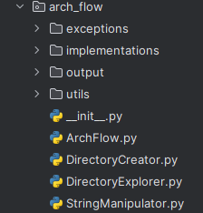
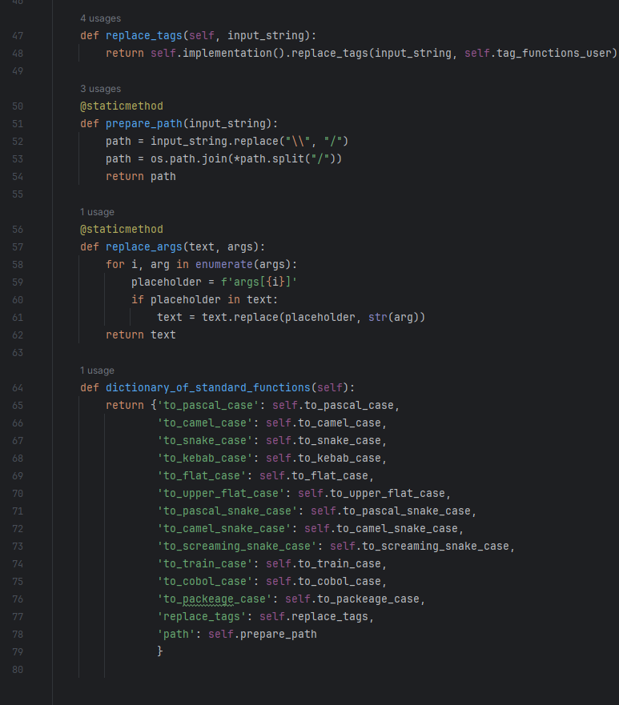
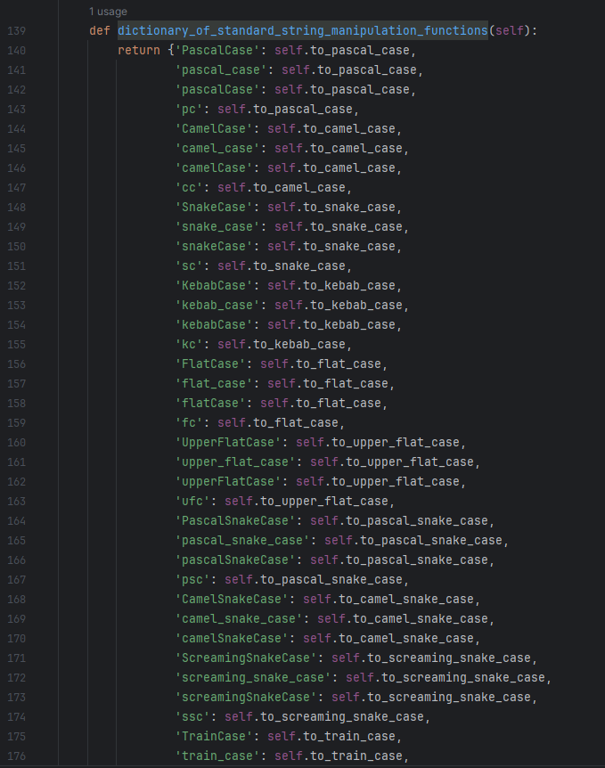
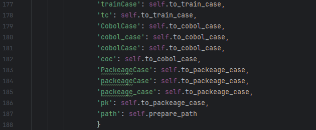
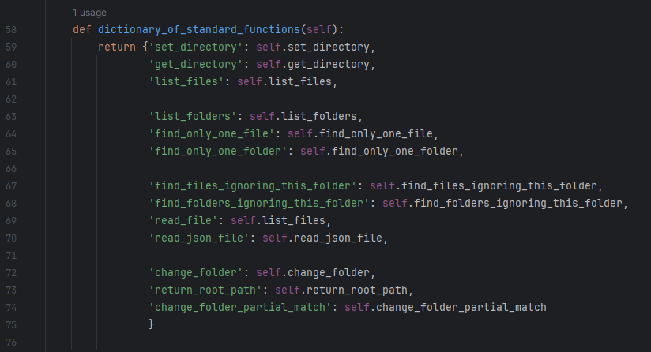
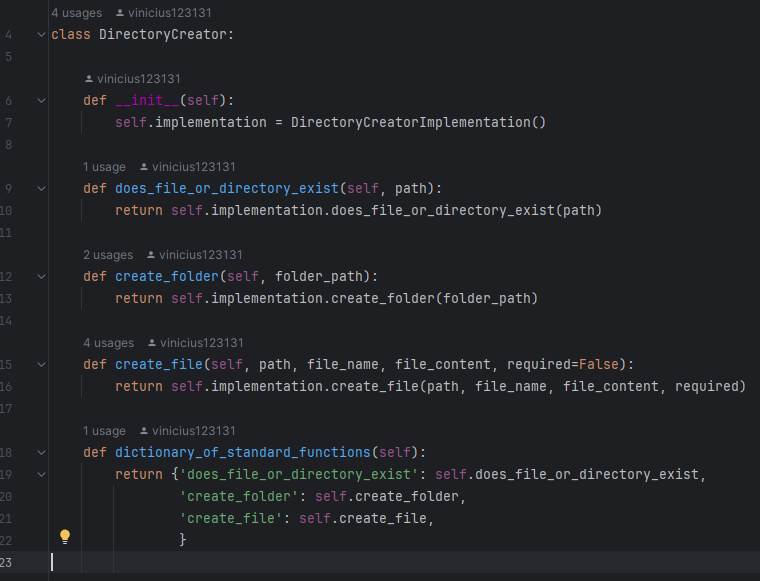

# 🤖 arch-flow
Bem vindo ao repositório do ArchFlow! O ArchFlow é uma biblioteca em python, open source, 
projetada para habilitar a automação da geração de arquivos e diretórios dinâmicos, a fim
de compor arquiteturas robustas de forma declarativa, abstraindo o trabalho manual que 
seria necessário sem ela.
<br><br>

### 🧑🏽‍💻 Instalação:

```commandline
pip install arch_flow
```


### 🧩 O conceito do Arch Flow

As funções que compõem o ArchFlow são como peças de lego: elas podem ser combinadas de 
várias formas, resultando inúmeras composições possíveis.

Por exemplo, digamos que você gostaria de criar um novo arquivo, você poderia simplesmente 
criar algo parecido com isso:
```python
import arch_flow

directory_creator = arch_flow.DirectoryCreator()

directory_creator.create_file(path="/file", file_name="file.txt", file_content="file content...")
```
Este código cria um arquivo sem que você precise se preocupar com os detalhes de implementação. 
Basta fornecer os atributos necessários. No entanto, se precisar criar uma nova pasta antes de criar
o arquivo, você pode fazer algo assim:

```python
import arch_flow

directory_creator = arch_flow.DirectoryCreator()

path_file = "file/new_file"
directory_creator.create_folder(path_file)
directory_creator.create_file(path=path_file, file_name="file.txt", file_content="file content...")
```
Observe como as funções são independentes uma da outra? Essa é a essência do ArchFlow.
Você pode combiná-las de diferentes maneiras, liberando sua criatividade, sem se preocupar
com os detalhes de implementação. Apenas siga os contratos de entrada e a lógica do seu código.
<br><br>

### 🗃️ Organização

Para garantir uma organização eficiente e carregar apenas o que é estritamente necessário para sua aplicação, 
o ArchFlow foi dividido na seguinte estrutura:



Cada arquivo possui um nome que reflete claramente sua especialidade, permitindo que você selecione
apenas os componentes necessários para sua tarefa. Por exemplo, se você precisa lidar apenas com 
operações de arquivo, como leitura, pesquisa ou filtragem, pode utilizar o _DirectoryExplorer_.

A seguir, apresentarei de forma resumida as funções e os contratos de cada arquivo, sem entrar em 
detalhes de implementação e iniciando da ordem inversa da que aparece na imagem.

#### 📄 StringManipulator.py



Na linha 64, encontraremos a função `dictionary_of_standard_functions`, presente em todos os outros 
arquivos da nossa lista. Essa função tem como objetivo fornecer uma lista das funções que o módulo 
oferece, sendo útil para verificar quais funcionalidades estão disponíveis em cada módulo.

Dentro da nossa lista, todas as funções que começam com o verbo `to` têm como objetivo converter 
algo em algo mais específico. Por exemplo, a função `to_pascal_case` espera receber uma String como
entrada e retorna essa String no formato PascalCase.

A função `path` também recebe uma String, que deve ser um caminho. Ela converte esse caminho para o
formato correto do sistema operacional em que o código está sendo executado. Essa função visa remover
a responsabilidade de lidar com barras de diretório do sistema operacional, deixando isso para 
o ArchFlow.

`replace_tags` é uma função com grande potencial para manipulação de Strings, tanto no conteúdo dos 
templates quanto nos nomes de arquivos, etc. Por exemplo, você pode fornecer uma string com o 
seguinte conteúdo:

```
conteudo da String... <to_pascal_case>conteudo relevante que deveria ficar em PascalCase</to_pascal_case> 
...resto do conteudo
```

Ao usar a função, ela analisa a string e, se encontrar uma tag, passa o conteúdo dela como argumento
para a função, retornando a string já formatada corretamente. As tags devem estar dentro de 
`<tag_abertura>` e `</tag_fechamento>` para evitar que trechos sejam transcritos indevidamente. 
Quais tags essa função permite por padrão? Podemos visualizar na seguinte lista:




#### 📄 DirectoryExplorer.py

O `DirectoryExplorer`, como o nome sugere, não se limita apenas à exploração de pastas, como o 
nome pode sugerir. Ele também é capaz de ler arquivos, navegar entre diretórios e executar 
outras operações. Para entender melhor suas funcionalidades, vamos analisar o 
`dictionary_of_standard_functions`.



Basicamente, o `DirectoryExplorer` permite listar arquivos em uma pasta específica, ler o 
conteúdo de arquivos específicos, navegar para um diretório com um nome específico, ou 
para um diretório cujo nome seja parcialmente correspondente a algo, entre outras funcionalidades
não listadas aqui. Você é livre para explorar essas funcionalidades e compreender seu comportamento.

#### 📄 DirectoryCreator.py

O DirectoryCreator, como o nome sugere, é responsável pela criação de pastas e arquivos, além de 
oferecer a funcionalidade de verificar a existência de um arquivo ou pasta.



Um detalhe importante nas funções que possuem o parâmetro required=False é que ele é utilizado 
para indicar o grau de importância das etapas realizadas durante a chamada da função. 
Por exemplo, ao utilizar a função create_file para criar um novo arquivo essencial para o 
funcionamento da sua aplicação, ao adicionar o campo required=True, caso ocorra algum problema 
durante a criação, o código irá interromper o fluxo normal da aplicação. Isso é útil porque 
elimina a necessidade de validações e verificações em etapas cruciais para o funcionamento geral
da aplicação.

#### 📄 ArchFlow.py

O `ArchFlow` é, por assim dizer, um centralizador de todas as funcionalidades, como `StringManipulator`,
`DirectoryExplorer` e `DirectoryCreator`, reunindo todas essas funcionalidades em um único lugar.


Ao implementá-lo de forma similar ao que você faria em Java, ele possibilita que sua classe herde
essas funções, de forma modularizada. Você pode simplesmente utilizar os módulos que julgar 
necessários, sem a obrigação de exportar tudo. Além disso, ele oferece a flexibilidade de permitir
o uso de apenas um módulo específico, caso seja desejado.

Essa é uma documentação geral do arch-flow. Sinta-se à vontade para interagir! Bem-vindo ao 
*ArchFlow*.